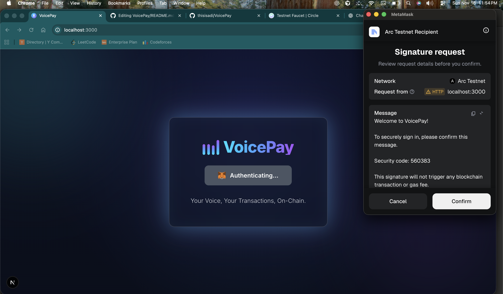
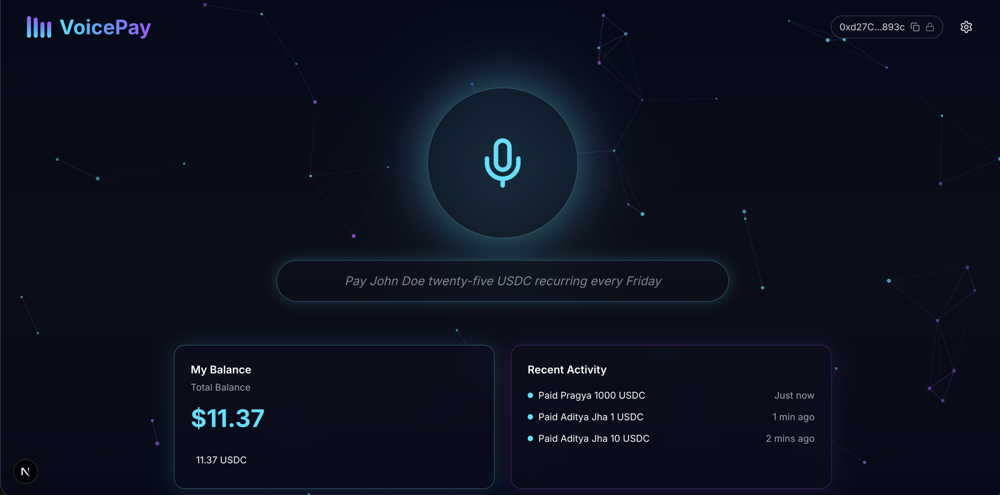
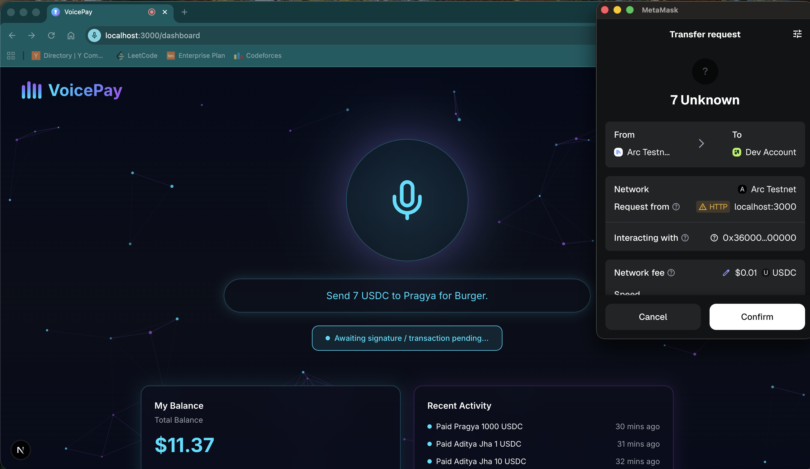
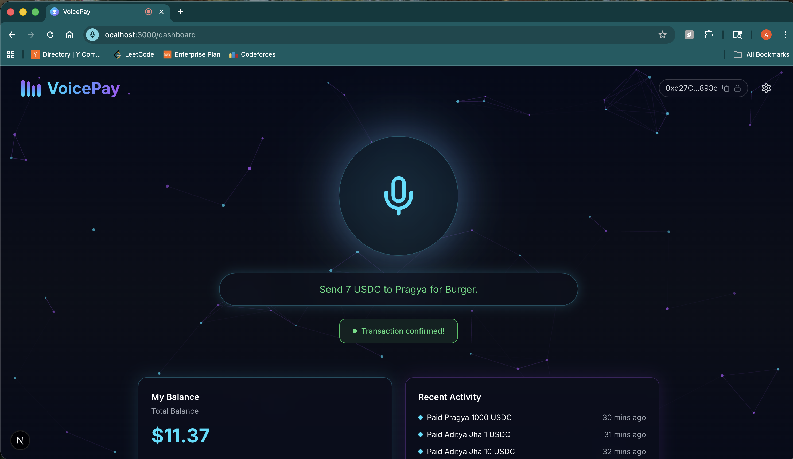
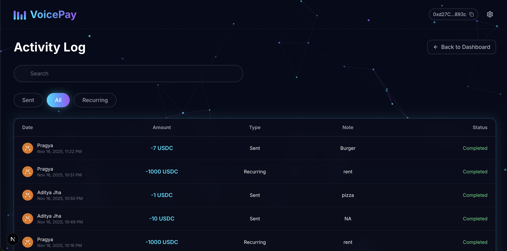
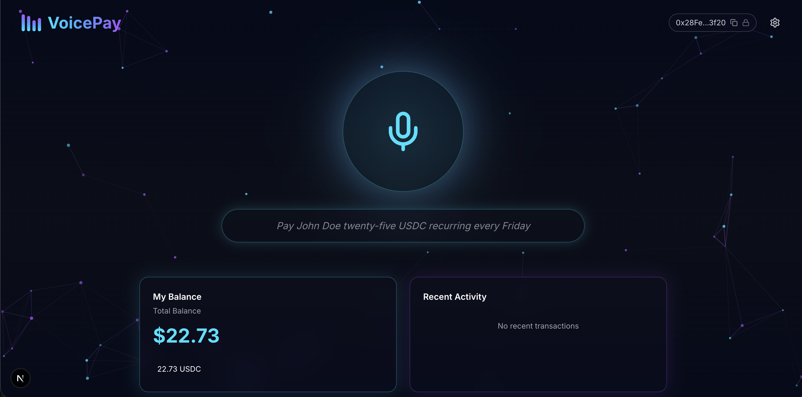
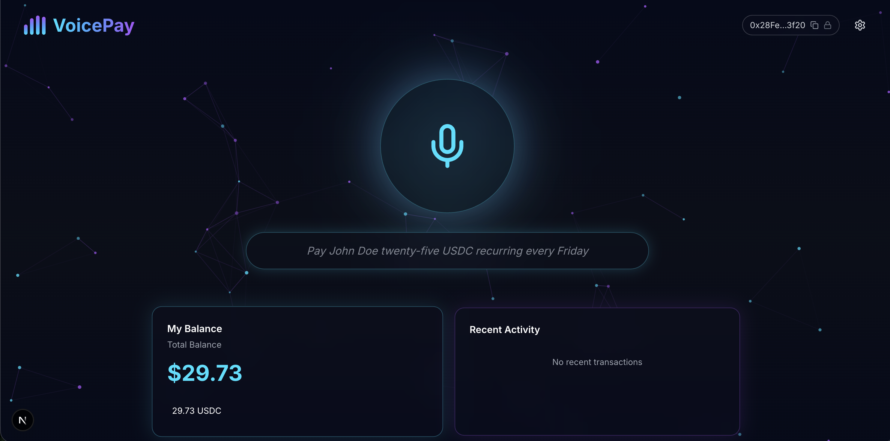
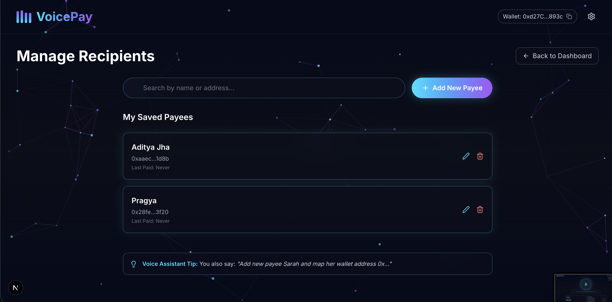
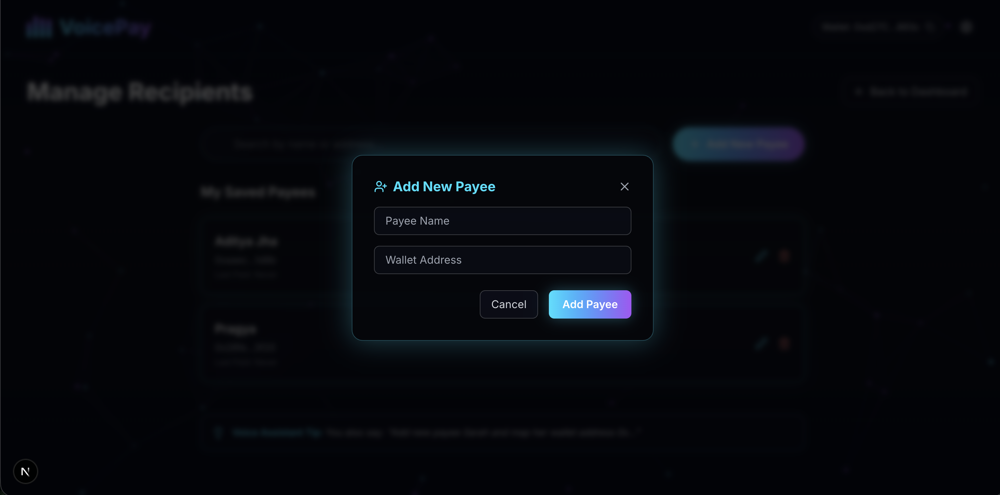
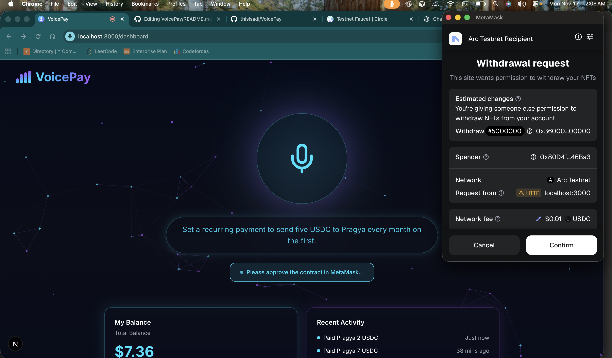

# VoicePay

Short overview
--------------
VoicePay is a voice-enabled, web3-first payments app that lets users create one-time and recurring on-chain payments via a friendly Next.js frontend and a Node/Express backend. The system uses a Cloudflare Worker (with Durable Objects and KV) as the scheduling and state layer for recipients, schedules, and transactions, and an Ethereum smart contract for recurring pull payments.

High-level architecture
-----------------------
- Frontend (`VoicePayFrontend`): Next.js (App Router) React UI that authenticates users via wallet signature, stores a JWT locally, and interacts with the backend to manage recipients, intents, and recurring setup. Uses `wagmi`, `viem`, and `ethers` for wallet/connect and on-chain interactions.
- Backend (`VoicePayBackend`): Express server exposing REST endpoints (`/auth`, `/recipients`, `/intent`, `/transactions`). Responsible for JWT issuance/verification, forwarding schedule creation to the Cloudflare Worker, and executing recurring payments via a server-side executor wallet (calls the recurring contract).
- Cloudflare Worker (`VoicePayBackend/cloudflare/voicepay-worker`): Durable Objects store per-user data (recipients, schedules, transactions) and a cron-style scheduler that executes due recurring payments; it signs requests to the backend using HMAC and writes transaction logs back into the DO.
- Smart Contract (`VoicePayBackend/recurring-contract`): Hardhat project containing `RecurringPull.sol` (pull-payment style contract used by the backend executor wallet to pull tokens with prior approval).

Key components & design choices
-------------------------------
- Authentication: Wallet-based sign-in (nonce -> personal_sign) on the worker DO, verified by the backend which issues a short-lived JWT (`JWT_SECRET`).
- Worker ↔ Backend trust: Worker signs backend requests with HMAC (`WORKER_SHARED_SECRET`) and backend validates via `workerAuth` middleware (prevents replay using timestamps).
- Scheduling & state: Durable Objects store canonical user state and schedules. Worker keeps an index (KV `SCHEDULE_KV`) for scanning due schedules.
- Recurring payments: Backend's protected route `/process-recurring` (signed by worker) uses an executor private key to call `pullPayment` on the recurring contract. The contract address is configured via `RECURRING_CONTRACT` env var.
- Intent parsing: Cloudflare Worker uses an AI assistant (Mistral) to parse natural language to structured payment intent JSON (see `parseIntent` in worker). This allows voice/natural language input to produce structured transactions.

Environment variables (used across the repo)
------------------------------------------
- `PORT` — backend listen port (used by `server.js`)
- `NEXT_PUBLIC_BACKEND_URL` — frontend -> backend base URL
- `CF_WORKER_URL` — Cloudflare Worker base URL used by backend
- `WORKER_SHARED_SECRET` — shared secret for HMAC (worker ↔ backend)
- `JWT_SECRET` — secret for signing JWTs
- `RECURRING_CONTRACT` — deployed contract address for recurring pull payments
- `EXECUTOR_PRIVATE_KEY` — private key used by backend to call the contract
- `RPC_URL` — JSON-RPC node endpoint for backend `ethers` provider
- `USDC_ADDRESS` — token address used for payments (optional fallback)

How data flows (high level)
---------------------------
1. User connects wallet in the Next.js frontend. Frontend calls backend `/auth/nonce` and `/auth/verify` to obtain a JWT.
2. User creates intents (via voice or text).
	- If the user speaks, the frontend records audio and sends it to ElevenLabs' speech-to-text API (configured via `NEXT_PUBLIC_ELEVENLABS_API_URL` / `NEXT_PUBLIC_ELEVENLABS_API_KEY`) to obtain a transcription.
	- The frontend then sends the transcribed text to the backend `/intent/parse-intent` endpoint. The backend forwards the text to the Cloudflare Worker which runs the AI parsing (`parseIntent`) to produce a structured payment intent JSON. The Worker may then update the user's Durable Object (recipients, schedules) as needed.
3. For recurring payments, frontend calls backend `/transactions/setup-recurring` which forwards a create-schedule request to the Worker; Worker stores the schedule in DO and writes an index entry to KV for scheduling.
4. Cron or scheduled logic in Worker scans `SCHEDULE_KV` and when a schedule is due, the Worker calls the backend `/transactions/process-recurring` using HMAC-signed request headers. Backend validates and executes `pullPayment` on-chain via the executor wallet.
5. Execution results are logged back into the DO (via `store-transaction`) so the user can view history.

User flow demonstration
------------------------
The following screenshots demonstrate the complete user flow, from authentication to transaction execution, and how transactions are reflected across different user accounts.

### Step 1: Wallet Connection & Authentication

*User connects their MetaMask wallet. The frontend requests a nonce from the backend, which is forwarded to the Cloudflare Worker's Durable Object. The user signs a message with their wallet, and upon verification, receives a JWT token for authenticated requests.*

### Step 2: Dashboard Overview

*After authentication, users see their dashboard with current balance, recent activity, and the voice command interface. The wallet address is displayed in the header (e.g., `0xd27C...893c`).*

### Step 3: Voice Command Input

*Users can initiate payments via voice commands. The microphone button records audio, which is transcribed by ElevenLabs. The transcribed text (e.g., "Send 7 USDC to Pragya for Burger") is then sent to the backend for AI-powered intent parsing.*

### Step 4: Intent Parsing & Transaction Initiation

*The Cloudflare Worker's AI (Mistral) parses the natural language into structured JSON. The frontend automatically initiates the transaction, showing "Awaiting signature / transaction pending..." while waiting for MetaMask confirmation.*

### Step 5: MetaMask Transaction Confirmation

*MetaMask popup appears for user confirmation. The transaction details show the transfer amount (7 USDC), recipient address, and network fee. Upon confirmation, the transaction is submitted to the blockchain.*

### Step 6: Transaction Confirmation

*After blockchain confirmation, the transaction status updates to "Transaction confirmed!" The transaction is automatically logged in the user's Durable Object for future reference.*

### Step 7: Activity Log - Sender's View

*The sender can view all their transactions in the Activity Log. Each transaction shows:*
- *Date and time*
- *Amount (negative for outgoing)*
- *Type (Sent or Recurring)*
- *Recipient name*
- *Note/description*
- *Status (Completed)*

*In this example, the sender (`0xd27C...893c`) can see:*
- *"Paid Pragya 7 USDC" (Just now) - Burger payment*
- *"Paid Pragya 1000 USDC" (30 mins ago) - Recurring rent payment*
- *"Paid Aditya Jha 1 USDC" (31 mins ago) - Pizza payment*

### Step 8: Cross-User Transaction Reflection - Recipient's View

*When the recipient (Pragya) first logs in with their wallet (`0x28Fe...3f20`), they see their original balance i.e. 22.73 USDC.*

*When the recipient (Pragya) logs in with their wallet (`0x28Fe...3f20`), they see their updated balance reflecting the received payments. The balance increases from the previous amount to show the incoming transfers.*

**Key Point:** Since all transactions are executed on-chain via the smart contract, the recipient's wallet balance automatically reflects incoming payments. The Durable Object system ensures that:
1. **On-chain state is the source of truth** - The recipient's USDC balance on the blockchain is updated immediately upon transaction confirmation
2. **Per-user transaction history** - Each user's Durable Object stores their own transaction history (sent/received), but the actual token balance comes from the blockchain
3. **Real-time balance updates** - The frontend uses `wagmi` to read the current USDC balance directly from the ERC20 contract, so recipients see updated balances immediately

### Step 9: Managing Recipients

*Users can manage their saved payees. The system stores recipient names mapped to wallet addresses in the user's Durable Object, allowing voice commands to use names instead of addresses (e.g., "Send $50 to John" instead of "Send $50 to 0x...").*

### Step 10: Adding/Editing Recipients

*Users can add new recipients with a name and wallet address. This data is stored in the Cloudflare Worker's Durable Object, enabling natural language recipient resolution during voice command parsing.*

### Step 11: Recurring Payment Setup

*For recurring payments, users approve the contract to spend tokens once. The schedule is stored in the Durable Object and indexed in KV storage. The Worker's cron job automatically executes payments at the specified intervals.*

### Technical Flow Summary
```
User A (Sender)                    Blockchain                    User B (Recipient)
     |                                  |                              |
     |-- Voice: "Send 7 USDC to B ---->|                              |
     |                                  |                              |
     |-- Parse Intent (AI) ----------->|                              |
     |                                  |                              |
     |-- Approve & Sign -------------->|                              |
     |                                  |                              |
     |-- Execute Transfer ------------>|-- USDC Transfer ----------->|
     |                                  |                              |
     |-- Log in DO ------------------->|                              |
     |                                  |                              |
     |                                  |                              |
     |                                  |<-- Balance Updated ----------|
     |                                  |                              |
     |                                  |                              |
     |                                  |-- User B logs in ------------>|
     |                                  |                              |
     |                                  |-- Read balance from chain --->|
     |                                  |                              |
     |                                  |-- Updated balance shown ----->|
```

**Important Notes:**
- **On-chain execution**: All payments are executed on the blockchain, making them immediately visible to recipients
- **Durable Objects**: Store per-user transaction history and recipient mappings, but do not hold actual token balances
- **Balance reading**: The frontend reads USDC balances directly from the ERC20 contract using `wagmi` and `viem`, ensuring real-time accuracy
- **Transaction history**: Each user's Durable Object maintains their own transaction log, but the blockchain is the authoritative source for token balances


Running the project (local dev)
--------------------------------
Note: these are minimal commands — confirm your Node.js version (recommend Node 18+). Adjust ports and env vars as needed. The frontend requires a few `NEXT_PUBLIC_*` environment variables (listed below) so the UI can call the backend, the ElevenLabs transcription API, and the testnet RPC.

1) Frontend
```bash
cd VoicePayFrontend
# Example (zsh) - set the env vars before running dev server
export NEXT_PUBLIC_BACKEND_URL="http://localhost:3001"
export NEXT_PUBLIC_ARC_RPC_URL="https://rpc.testnet.arc.network"
export NEXT_PUBLIC_USDC_ADDRESS="0xYourUSDCAddress"
export NEXT_PUBLIC_USDC_DECIMALS="6"
export NEXT_PUBLIC_ELEVENLABS_API_URL="https://api.elevenlabs.io/v1/speech-to-text"
export NEXT_PUBLIC_ELEVENLABS_API_KEY="your_elevenlabs_key"


npm run dev
```
Open `http://localhost:3000` (default Next.js port).

2) Backend
```bash
cd VoicePayBackend
npm install
# export env vars, for example (zsh):
export PORT=3001
export JWT_SECRET=your_jwt_secret
export CF_WORKER_URL=http://localhost:8787
export WORKER_SHARED_SECRET=some_shared_secret
export RECURRING_CONTRACT=0x...
export EXECUTOR_PRIVATE_KEY=0x...
export RPC_URL=https://your-rpc
export USDC_ADDRESS=0xYourUSDCAddress

node server.js
```

3) Cloudflare Worker (local testing / dev)
- The Worker resides in `VoicePayBackend/cloudflare/voicepay-worker`. It includes Durable Object code and expects to be deployed with Wrangler. See `wrangler.jsonc` in that folder.
- For local testing you can use `wrangler dev` or deploy to Cloudflare with `wrangler publish` after setting the required secrets and DO bindings. Be sure to set `WORKER_SHARED_SECRET`, `RECURRING_CONTRACT`, and any DO bindings used by the worker.

4) Smart contract (Hardhat)
```bash
cd VoicePayBackend/recurring-contract
npm install
# Use hardhat to compile/deploy/test
npx hardhat compile
# deploy scripts are in `scripts/deploy.js` (adjust network config in `hardhat.config.js`)
```
